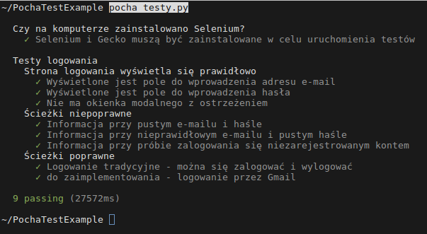

Przykładowy test strony logowania napisany w Pythonie.
Wykorzystuje:
* Pocha - odpowiednik Mocha dla Pythona
* Selenium

W celu urochmienia testów oprócz zainstalowania 'Pocha' i 'Selenium' konieczne jest pobranie Gecko (Firefox).

